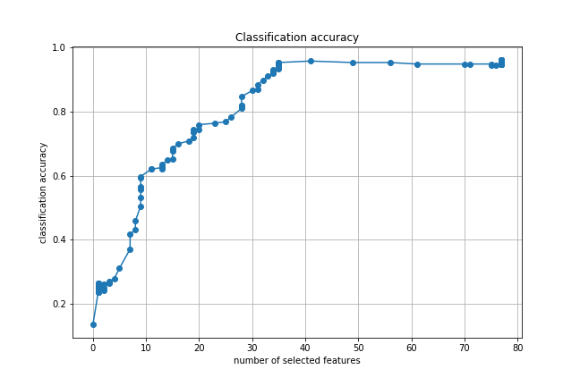

# Feature Selection in Neural Networks
Demo code for the LassoNet method proposed in "LassoNet: A Neural Network with Feature Sparsity".

## Supporting material
- [Paper](https://arxiv.org/pdf/1907.12207.pdf)
- Video tutorial [[short version](https://www.youtube.com/watch?v=G5vPojso9PU)] [[long version](https://www.youtube.com/watch?v=ztGcoMPazwc)]
- [Slides](https://ismael.lemhadri.org/papers/pdf/lassonet_slides.pdf)
- [Poster](https://ismael.lemhadri.org/papers/pdf/lassonet_poster.pdf)

## Intro
Much work has been done recently to make neural networks more interpretable, and one obvious approach is to arrange for the network to use only a subset of the available features. In linear models, Lasso (or L1-regularized) regression assigns zero weights to the most irrelevant or redundant features, and is widely used in data science. However the Lasso only applies to linear models. Here we introduce LassoNet, a neural network framework with global feature selection. Our approach enforces a hierarchy: specifically a feature can participate in a hidden unit only if its linear representative is active. Unlike other approaches to feature selection for neural nets, our method uses a modified objective function with constraints, and so integrates feature selection with the parameter learning directly. As a result, it delivers an entire regularization path of solutions with a range of feature sparsity. On systematic experiments, LassoNet significantly outperforms state-of-the-art methods for feature selection and regression. The LassoNet method uses projected proximal gradient descent, and generalizes directly to deep networks. It can be implemented by adding just a few lines of code to a standard neural network.
<!---

*Figure obtained from running LassoNet on the [Mice Protein Expression Data Set] (https://archive.ics.uci.edu/ml/datasets/Mice+Protein+Expression), showing the test accuracy per number of features selected.*
--->

## Demo

### Requirements
- pytorch 1.3.1
- matplotlib 3.1.1

### Execution
First install :
```bash
cd core
pip install .
```
Then run the following python script for a simple demonstration of LassoNet on the Mice Dataset:
```bash
python examples/run_demo_mice.py
```
See core/lassonet/lassonet_trainer.py and core/lassonet/models.py for details.

One png file will be saved in your directory, which is a visualization of the results on the MICE dataset. An interactive version is provided in the notebook ```examples/run_demo_mice.ipynb```. 

## Citation
For more details, see the accompanying paper: ["LassoNet: A Neural Network with Feature Sparsity"](https://arxiv.org/abs/1907.12207), *AISTATS 2021*, and please use the citation below.

```
@article{lemhadri2019neural,
  title={A neural network with feature sparsity},
  author={Lemhadri, Ismael and Ruan, Feng and Tibshirani, Robert},
  journal={arXiv preprint arXiv:1907.12207},
  year={2019}
}
```
<p align="center">
  
</p>


## Acknowledgments
Thanks and acknowledgments to [Louis Abraham](https://louisabraham.github.io/) for the PyTorch version of LassoNet. This repository heavily borrows on [Louis Abraham's repository](https://github.com/louisabraham/DeepLasso).
